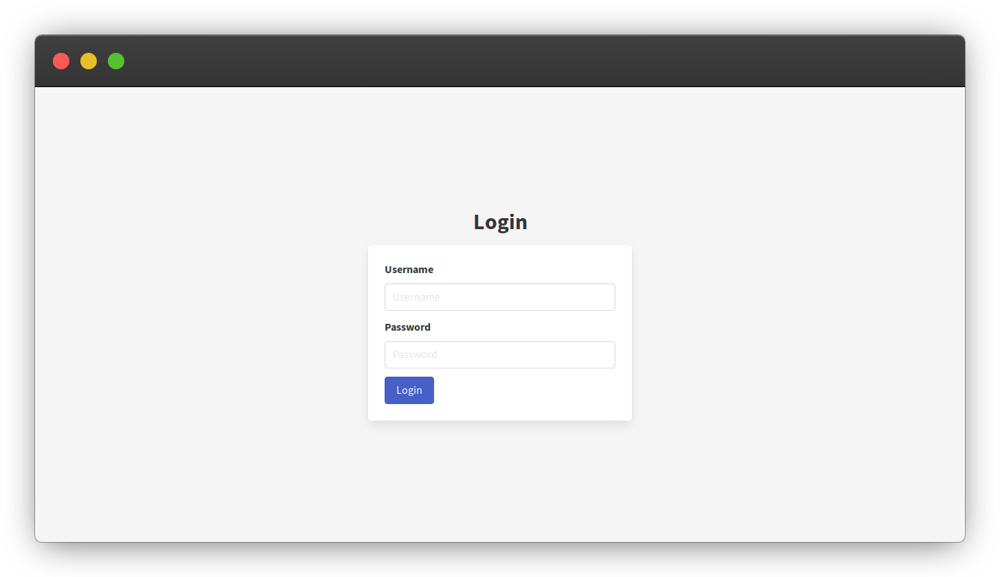
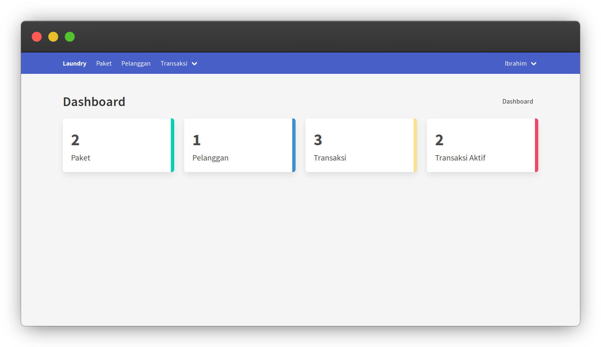
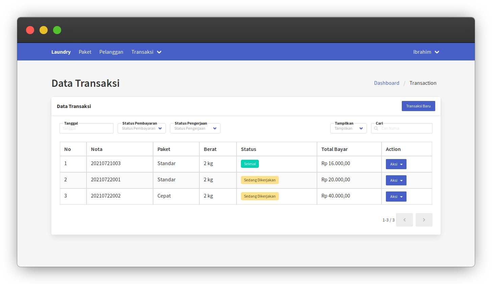
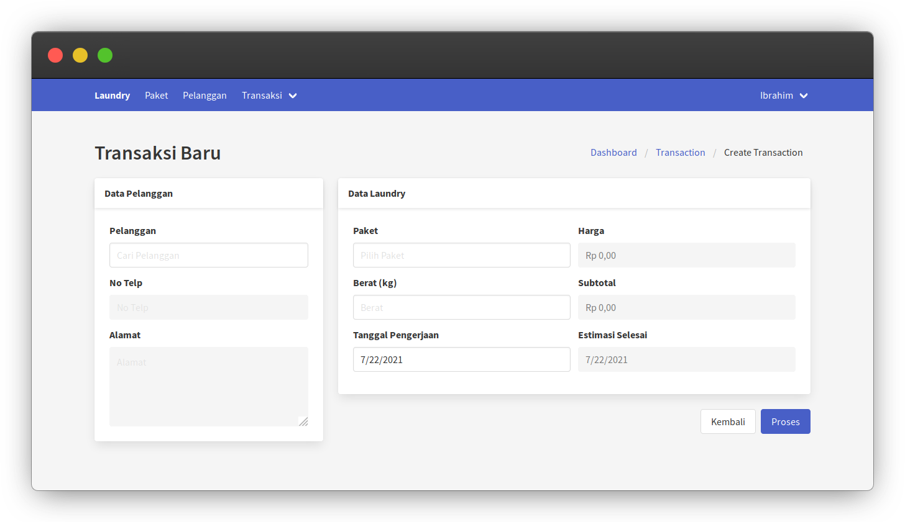
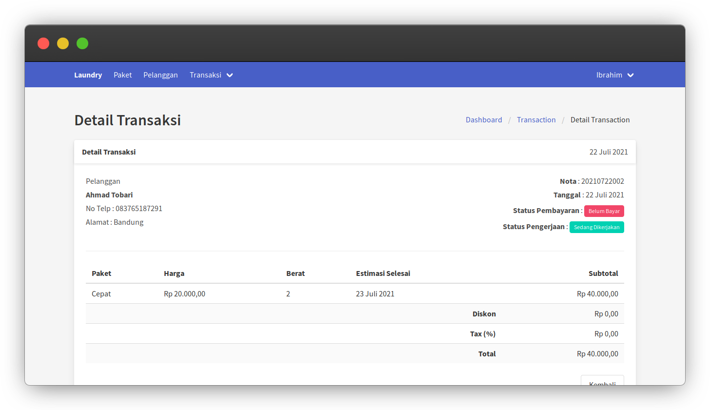

## Laravel Vue Laundry

Aplikasi Laundry dengan Laravel 8 dan Vue JS, sudah selesai namun masih banyak bug dan fitur yang perlu dibuat, males

### Instalasi

* Clone repo ini
* Salin `env.example` ke `env`. Sesuaikan konfigurasi database anda.
* composer install/update
* npm install && npm run dev
* php artisan key:generate
* php artisan storage:link
* php artisan migrate --seed
* php artisan serve
* Enjoy

## Screenshot

#### Login

#### Dashboard

#### Data Transaksi

#### Transaksi Baru

#### Detail Transaksi

